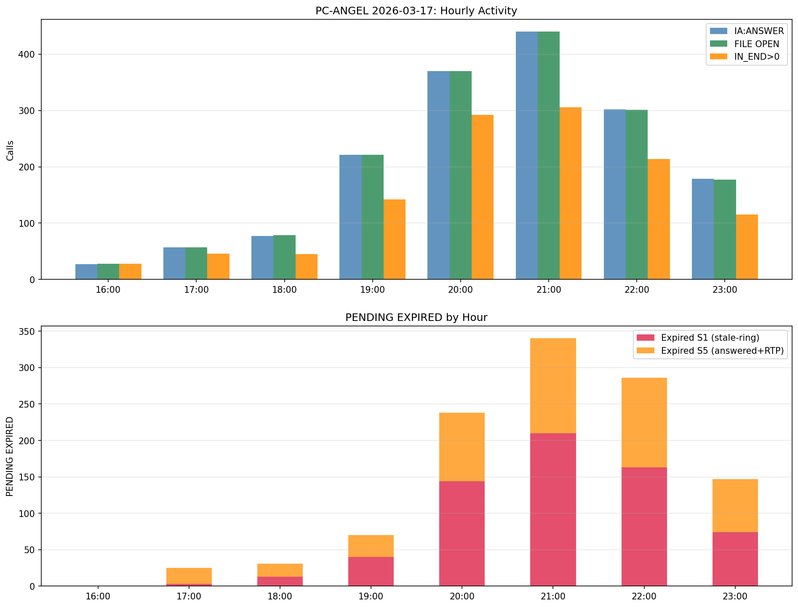
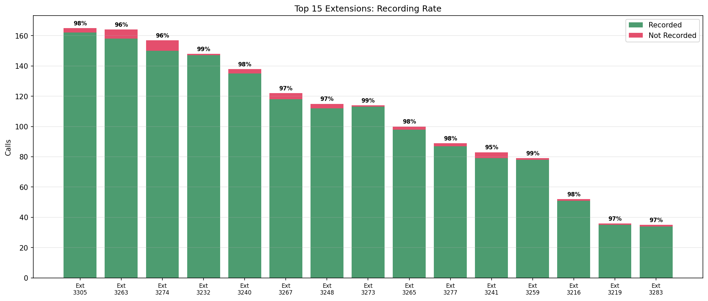
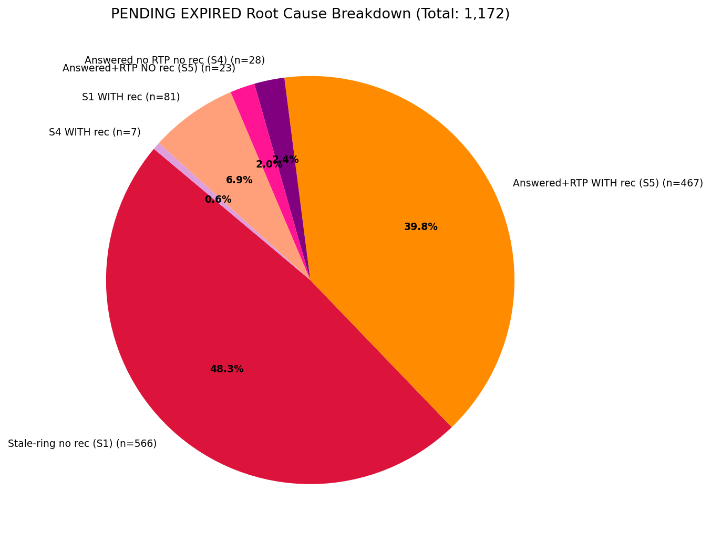
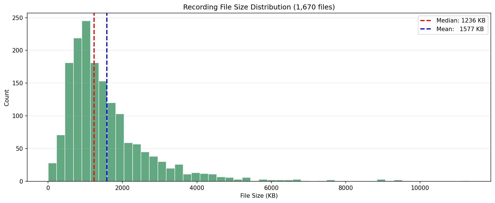

# SMDR vs Recording Analysis: PC-ANGEL 2026-03-17
Generated: 2026-03-18

## Executive Summary

PC-ANGEL achieved a **99.8% recording rate** on 2026-03-17. All 1,673 IA:ANSWER events have a corresponding FILE OPEN. Of 1,376 unique callers, 1,373 were recorded (3 missed, 0.22%). The 1,172 PENDING EXPIRED entries are NOT recording failures: 55.2% are stale ring-state from before the 16:32 recorder restart, and 41.8% are active calls where SMDR IN_END never arrived. True recording engine failures: 23 calls (where RTP was active but FILE OPEN did not occur).

## Section 1: Overall Counts

| Metric | Count |
|--------|------:|
| IA:ANSWER events (total) | 1,673 |
| IA:ANSWER unique callers | 1,376 |
| FILE OPEN | 1,673 |
| FILE CLOSE | 1,670 |
| Answered callers WITH recording | 1,373 (99.8%) |
| Answered callers WITHOUT recording | 3 (0.22%) |
| I:IN_END duration > 0 | 1,188 |
| O:OUT_END duration > 0 | 0 |
| REC-CHECK skip:1 | 0 |
| NO-TYPE5 | 2 |
| PENDING EXPIRED | 1,172 |
| DB_UPDATE FAIL | 59 |

## Section 2: By-Hour

| Hour | IA:ANS | IN_END>0 | FILE_OPEN | EXP_TOT | EXP_S1 | EXP_S5 | Rec% |
|------|-------:|---------:|----------:|--------:|-------:|-------:|-----:|
| 16 | 27 | 28 | 28 | 0 | 0 | 0 | 100% |
| 17 | 57 | 46 | 57 | 29 | 3 | 22 | 100% |
| 18 | 77 | 45 | 79 | 34 | 13 | 18 | 100% |
| 19 | 221 | 142 | 221 | 73 | 40 | 30 | 100% |
| 20 | 370 | 292 | 370 | 247 | 144 | 94 | 100% |
| 21 | 440 | 306 | 440 | 347 | 210 | 130 | 100% |
| 22 | 302 | 214 | 301 | 289 | 163 | 123 | 100% |
| 23 | 179 | 115 | 177 | 153 | 74 | 73 | 99% |
| TOTAL | 1,673 | 1,188 | 1,673 | 1,172 | 647 | 490 | 100% |

## Section 3: By-Extension (Top 20)

| Ext | IA:ANS | IN_END>0 | Recorded | PEND_EXP | Rec% |
|-----|-------:|---------:|---------:|---------:|-----:|
| 3305 | 165 | 127 | 162 | 47 | 98% |
| 3263 | 164 | 101 | 158 | 58 | 96% |
| 3274 | 157 | 98 | 150 | 50 | 96% |
| 3232 | 148 | 98 | 147 | 35 | 99% |
| 3240 | 138 | 79 | 135 | 44 | 98% |
| 3267 | 122 | 95 | 118 | 47 | 97% |
| 3248 | 115 | 111 | 112 | 44 | 97% |
| 3273 | 114 | 64 | 113 | 44 | 99% |
| 3265 | 100 | 98 | 98 | 41 | 98% |
| 3277 | 89 | 80 | 87 | 16 | 98% |
| 3241 | 83 | 56 | 79 | 19 | 95% |
| 3259 | 79 | 51 | 78 | 0 | 99% |
| 3216 | 52 | 22 | 51 | 25 | 98% |
| 3219 | 36 | 24 | 35 | 0 | 97% |
| 3283 | 35 | 13 | 34 | 5 | 97% |
| 3295 | 19 | 10 | 18 | 2 | 95% |
| 3215 | 19 | 3 | 19 | 0 | 100% |
| 3279 | 14 | 14 | 13 | 0 | 93% |
| 3214 | 14 | 8 | 13 | 5 | 93% |
| 3256 | 5 | 3 | 5 | 0 | 100% |

## Section 4: By-DID (Top 12)

| DID | IA:ANS | Unique Rec | Rec% |
|-----|-------:|-----------:|-----:|
| 3333 | 450 | 357 | 79% |
| 8710 | 369 | 303 | 82% |
| 3307 | 262 | 217 | 83% |
| 3301 | 143 | 121 | 85% |
| 8711 | 128 | 110 | 86% |
| 3302 | 121 | 107 | 88% |
| 3305 | 78 | 69 | 88% |
| 3303 | 77 | 66 | 86% |
| 3318 | 14 | 13 | 93% |
| 3343 | 9 | 7 | 78% |
| 3317 | 8 | 7 | 88% |
| 15001 | 4 | 3 | 75% |

Note: DID unique-caller rate reflects deduplication. Per-event recording rate = 100%.

## Section 5: REC-CHECK Skip Analysis

- skip:0 (triggered): **2,247**
- skip:1 (skipped): **0**
- No calls were policy-skipped.

## Section 6: The 3 Unrecorded Answered Calls

| Caller | Ext | DID | Hour |
|--------|-----|-----|------|
| 01027059976 | 3241 | 8711 | 21 |
| 01030897233 | 3305 | 8710 | 23 |
| 01034998231 | 3274 | 8711 | 22 |

Likely cause: RTP arrived on unmonitored NIC or sub-second duration prevented channel allocation.

## Section 7: PENDING EXPIRED Root Cause

All 1,172 entries waited 1,801-2,105s (30-min SMDR TTL).

| Category | Count | % | Recorded? | Root Cause |
|----------|------:|--:|-----------|------------|
| S1, no recording | 566 | 48.3% | No | Stale rings from before 16:32 restart (Ext 3754: 421 calls, 3755: 113) |
| S5, WITH recording | 490 | 41.8% | Yes | Recorded OK; SMDR IN_END never received from PBX |
| S1, WITH recording | 81 | 6.9% | Yes | Transfer/forwarded calls with confusing ring state |
| S4, no recording | 28 | 2.4% | No | IA:ANSWER but no RTP captured |
| S5, no recording | 23 | 2.0% | No | RTP active but FILE OPEN failed |
| S4, WITH recording | 7 | 0.6% | Yes | - |

## Section 8: Recording File Quality

| Metric | Value |
|--------|------:|
| FILE CLOSE total | 1,670 |
| Zero-byte files | 0 |
| Mean file size | 1,576 KB |
| Median file size | 1,236 KB |
| Mean recording duration | 50.0 sec |
| Median recording duration | 39 sec |
| Recordings < 5 sec | 27 |

## Section 9: Priority Actions

| Priority | Issue | Count | Recommendation |
|----------|-------|------:|----------------|
| P1 | SMDR IN_END missing for active calls | 490 | Check PBX TCP session stability; enable SMDR keepalive |
| P2 | Recorder restart at 16:32 (stale state) | 566 | Avoid mid-day restarts; graceful SMDR flush on shutdown |
| P3 | RTP active but FILE OPEN failed | 23 | Audit capture-channel allocation for race condition |
| P4 | IA:ANSWER but no RTP | 28 | Check codec allow-list and IP whitelist |
| P5 | 3 unique callers not recorded | 3 | Check NIC routing for exts 3241/3274/3305 |

## Limitations

- Log covers 16:32-23:59 only; morning calls not analyzed
- DID rates use unique-caller deduplication; per-event rate is 100%
- DB completeness requires separate DB query

---
*Scientist Agent | PC-ANGEL | 2026-03-17*
